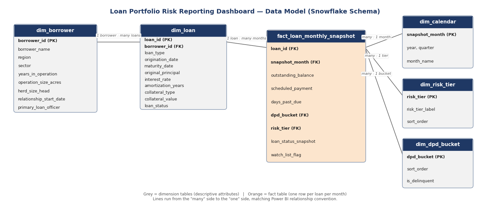

# Loan Portfolio Risk Reporting Dashboard

A business analysis + data analytics portfolio project: a full BA deliverable suite plus a working Power BI dashboard, built end-to-end for a fictional Canadian agricultural lender.

> **Note:** Harvest Trust Financial (HTF) is entirely fictional. All data in this repository is synthetically generated. This project is not affiliated with, and makes no claims about, any real financial institution, including Farm Credit Canada.

## The problem

Agricultural lenders commonly rely on fragmented spreadsheets and periodic manual reviews to track loan performance — a documented, industry-wide pattern (see [LoanPro](https://www.loanpro.io/blog/agricultural-lending/) and [FarmRaise](https://www.farmraise.com/blog/2025-risk-management-for-lenders-building-resilient-rural-loan-portfolios)), not a hypothetical one. That manual process delays detection of early warning signs — rising delinquency, growing concentration in one region or sector — until intervention is already more expensive.

This project models that problem for a fictional lender, Harvest Trust Financial (HTF), and builds the fix: a single, self-serve Power BI dashboard replacing a simulated 5–7 day manual reporting cycle.

## What's included

This repo follows the standard BA project lifecycle, phase by phase:

| Folder | Phase | Contents |
|---|---|---|
| [`01_project_brief/`](01_project_brief) | 1 | Project brief — business problem, scope, stakeholders, success criteria |
| [`02_stakeholder_analysis/`](02_stakeholder_analysis) | 2 | Stakeholder register, Power/Interest matrix, RACI chart |
| [`03_requirements/`](03_requirements) | 3 | Business/functional/non-functional requirements, MoSCoW-prioritized, with a full traceability matrix |
| [`04_data/`](04_data) | 4 | Python script generating the synthetic loan portfolio dataset, plus the resulting CSVs |
| [`05_data_model/`](05_data_model) | 5 | Data model design — ER diagram, table relationships, field-level data dictionary |
| [`06_dashboard/`](06_dashboard) | 6 | Power BI build guide — DAX measures, page layouts, filter design, formatting standards |
| [`07_portfolio_package/`](07_portfolio_package) | 7 | Dashboard screenshots and the combined portfolio PDF |

The finished `.pbix` file isn't committed here (Power BI files are large binaries); the dashboard is fully documented in `06_dashboard/` and shown below in screenshots.

## The dashboard

**Portfolio Overview** — executive summary: total exposure, delinquency rate, risk tier mix, and sector concentration at a glance.

**Regional & Sector Analysis** — a region × sector heat map that surfaces exactly where concentration and risk severity intersect. This view is what caught a real finding in the synthetic data: Saskatchewan/Livestock sits at 17.82% delinquency, well above every other segment — a specific, actionable insight a flat spreadsheet report would have buried.

**Watchlist & Loan Detail** — loans that moved into a worse risk tier or delinquency bucket since the prior month, surfaced for follow-up.

**Data & Definitions** — the dashboard's glossary, embedded directly in the file so "risk tier" and "delinquency bucket" mean the same thing to everyone looking at it.

**Loan Detail (drillthrough)** — right-click any loan on the Watchlist to see its full attributes and 24-month balance history.

## The data model

A snowflake schema: one fact table (`fact_loan_monthly_snapshot`, one row per loan per month) surrounded by dimension and lookup tables.

Full field-level definitions, relationships, and business rules are in [`05_data_model/Phase5_Data_Model_Design.xlsx`](05_data_model/Phase5_Data_Model_Design.xlsx).

## The synthetic dataset

Generated in Python (pandas/NumPy) — see [`04_data/generate_synthetic_data.py`](04_data/generate_synthetic_data.py):

- 380 borrowers across Saskatchewan, Alberta, and Manitoba, across four agricultural sectors
- 539 loans (Term Loans, Operating Lines of Credit, Equipment Loans, Farm Mortgages)
- A 24-month monthly snapshot (9,372 rows) with deliberate seasonality — delinquency risk rises before spring seeding and eases after harvest, rather than moving randomly

Two bugs were caught and fixed during generation, worth calling out because catching them mattered more than writing the code in the first place: Operating Lines of Credit were incorrectly "maturing" after one year (they're revolving facilities, not term loans), and an early version of the delinquency model had no mean-reversion and drifted from 5% to 18% over two simulated years instead of settling around a stable baseline.

## A DAX lesson worth keeping

The dashboard's KPI cards need to show the latest month by default, but also respect a user picking a specific past month from a slicer. The first version of this logic (`CALCULATE(..., dim_calendar[snapshot_month] = [Latest Snapshot Month])`, where `Latest Snapshot Month` used `ALLSELECTED`) returned blank the moment a specific past month was selected, because forcing "latest" conflicted with the slicer's own filter on the same column.

The fix documented in full in [`06_dashboard/Phase6_Dashboard_Build_Guide.docx`](06_dashboard/Phase6_Dashboard_Build_Guide.docx) — is `SELECTEDVALUE(fact_loan_monthly_snapshot[snapshot_month], [Latest Snapshot Month])` function that checks if a single month is already selected, use it directly; otherwise, fall back to latest. It's a small pattern, but it's the difference between a dashboard that quietly breaks under normal use and one that doesn't.

## Dashboard Screenshots

- Profile Overview
    

- Regional and Sector Analysis
    

- Watchlist and Loan Detail
    

- Loan Details (Drill Through)
    

- Data And Definitions
    

## Tools

Power BI Desktop (DAX, data modeling) · Python (pandas, NumPy) for synthetic data generation · Microsoft Word & Excel for BA deliverables

## Author

**Dwij Siyal** — Business Analyst
[dwijsiyal@gmail.com](mailto:dwijsiyal@gmail.com) · [linkedin.com/in/dwij-siyal-9b98a61a1](https://www.linkedin.com/in/dwij-siyal-9b98a61a1/)
